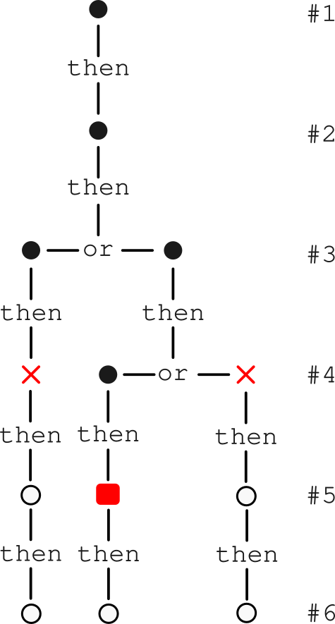

```{r, include = FALSE}
knitr::opts_chunk$set(
  collapse = TRUE,
  comment = "#>"
)
```

```{r setup, echo=FALSE}
library(parcr)
```

## Tracking where a parser error occurs

When you just get a fail `[]` as the output when a parser fails on a long input then it can become challenging to find out what went wrong. It would help a lot if you would know the index number ("line" number) of the input on which the parser fails. This means that the parser has to track where it is and where it fails. Since the only function that shifts to a next index is the `%then%` combinator, and since any other function that shifts to the right, like the repeater functions (`zero_or_more()`, *etc.*) is based on this function, we just have to count the number of times the `%then%` combinator was called up to the failure to know where the parser failed. A complication is that we may be testing alternative parsers implemented by the `%or%` combinator, and the parser may fail on different lines in the alternative "arms". In that case we will say that the parser fails in the element with the highest index when both arms of an `%or%` combinator fail. The package returns a `marker` object (printed as `[]`) with that element index number as an attribute. The principle is illustrated in the figure below.

```{r,out.width="30%", fig.align='left', echo=FALSE, fig.cap="<i>**Illustration of marker positioning when a parser fails on an input vector of length 6**. Each filled dot represents a successful parse. A `%then%` combinator shifts to the next element whereas an `%or%` combinator applies alternative parsers to the input. The parser fails at the red crosses and the red square. A marker (red square) will be put at the parser that fails at the input element with the highest index, which is element #5 here.</i>"}

```

In the current implementation we chose to track the current element index number with a state variable. The principle of using state variables is described in [section 7.4](https://r-pkgs.org/data.html#sec-data-state) of [R Packages (2e)](https://r-pkgs.org/).

Note that proper tracking and error messaging only takes place when the parser is wrapped in the `reporter()` function. Below we illustrate the example above by parsing the first 6 letters of the alphabet by a parser that fails on the indicated positions.

```{r}
arm1 <- function() {
  literal("D") %then%
    literal("E") %then%
    literal("F") %then%
    literal("G")
}

arm2 <- function() {
  literal("C") %then% 
    (arm21() %or% arm22())
}

arm21 <- function() {
  literal("D") %then%
    literal("F") %then%
    literal("G")
}

arm22 <- function() {
  literal("E") %then%
    literal("F") %then%
    literal("G")
}

p <- function() {
  literal("A") %then%
    literal("B") %then%
    (arm1() %or% arm2())
}

# The following code generates an error message
try(reporter((p() %then% eol()))(LETTERS[1:6]))
```

